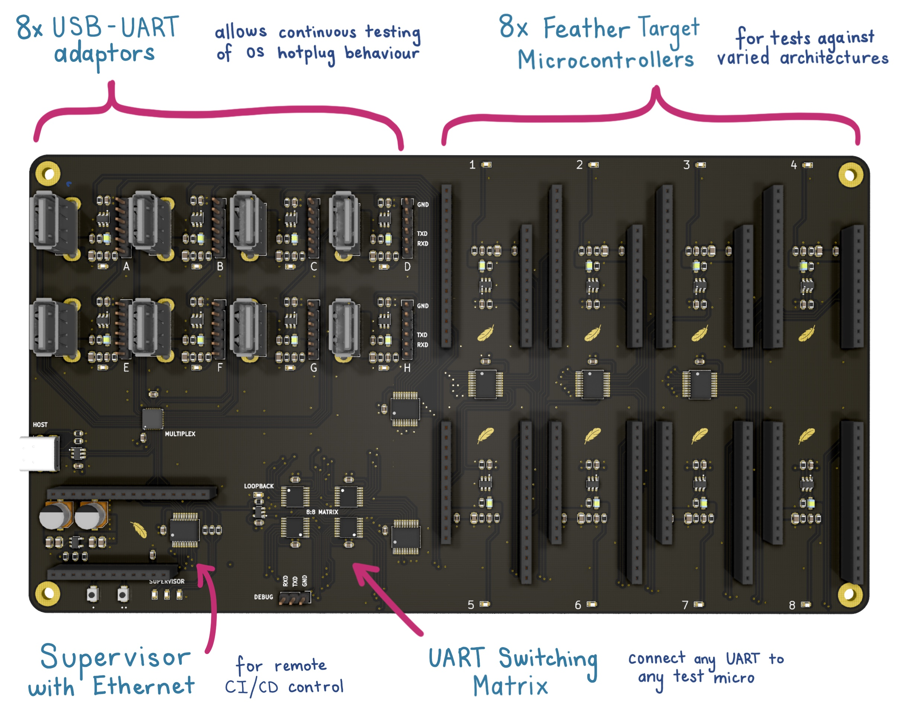

# Electric UI CI Arena
Hardware for continuous integration testing of serial interfaces and microcontrollers.

The board (KiCAD files in `/hardware`) exposes control to a CI build worker to power up any of the USB-UART adaptors in either loopback mode, or connected to any **one** of the hardware targets for a total test matrix of 72 combinations. 

Intended to run tests for hot-plug detection (by controlling the mux or USB power control), disconnection handling (by re-routing serial to the void) and to validate a wide range of microcontroller architectures and their corresponding toolchains.

## USB to UART Validation

Up to 8 USB ports are provided behind a USB mux from the host.

Individual power switching is available per-port, with optional routing of the USB-UART adaptor's serial lines to either loop-back, or to one of the target microcontrollers.

The following adaptors are used as test adaptors:

- [FT232RQ](https://www.sparkfun.com/products/9717)
- PL2303
- [CP2012](https://www.adafruit.com/product/954)
- CH340G

In the future, we hope to add Bluetooth/WiFi adaptors for wireless tests against compatible targets.

## Microcontroller Validation

8 power-switched targets are supported with connections to hardware serial. The [Adafruit Feather specification](https://learn.adafruit.com/adafruit-feather/feather-specification) is used, as a majority of planned targets are available in Feather format.

The following boards are used as test devices:

- [ATMEL 328P](https://www.adafruit.com/product/3458)
- [ATMEL SAMD21G](https://www.adafruit.com/product/2772)
- [ST STM32F405](https://www.adafruit.com/product/4382) with CubeHAL
- [Nordic nRF52840](https://www.adafruit.com/product/4516) 
- [RISC-V FE310](https://www.sparkfun.com/products/15799) with Zephyr RTOS
- [Ambiq Apollo3 ARM-M4F (Sparkfun Artemis)](https://www.sparkfun.com/products/15574) 
- [Espressif ESP32](https://www.sparkfun.com/products/15663) with ESP-IDF
- [Teensy 3.2](https://www.pjrc.com/store/teensy32.html) & [Teensy/Feather adaptor](Teensy/Feather adaptor) with Arduino

Test hardware will be flashed with a mix of native 'bare metal' images, and at least one target will act as validation of the Arduino framework.

When populating the test Feather boards with headers, use 'stacking' headers to allow for future sensor/display additions to targets.

## Supervisory Control

An additional Feather is provided to act as the supervisor. This connects to the CI server using a [ethernet featherwing](https://www.adafruit.com/product/3201).

The supervisor (through I2C expanders) controls power switches to each of the serial adaptors and test devices, and has 2 IO lines to each microcontroller to allow for input/output checks.

An analog line is shared across all modules, with the intent of using the supervisor's DAC output, allowing additional tests.

Firmware is in `/firmware`

# Manufacture

- I used JLPCB's 4-layer JLC7628 controlled impedance process.
- No stencil was ordered, as 2 units with low SMD part count is easy enough to paste by hand.
- All components were available from Digikey.
- Microcontroller targets were bought from Sparkfun and Adafruit (via Digikey)
- Assembled per board costs just under $100AUD.
- Loaded price (with listed microcontrollers, USB-serial adaptors, supervisor w ethernet) approx $500AUD.

See `/hardware/output/arena-BOM.html` for PCB BOM.

